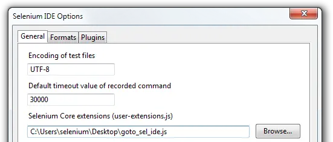

# 用户自定义扩展

用户自定义扩展是用户自己创建的 JavaScript 文件，对 Selenium IDE 现有的功能进行定制以及功能扩展。通常这种定制和扩展是以自定义命令的形式来体现的，当然也不仅限于命令。

[这里](http://wiki.openqa.org/display/SEL/Contributed+User-Extensions)可以找到很多有用的扩展。

*注意：这部分信息已经过时，我们将很快修改。*

也许最受欢迎的 Selenium IDE 扩展就是流程控制，流程控制扩展将提供 while 循环和条件判断。这个扩展是 [goto_sel_ide.js](http://wiki.openqa.org/download/attachments/379/goto_sel_ide.js)。如何使用这个扩展所提供的功能，看看作者创建的[页面](http://51elliot.blogspot.com/2008/02/selenium-ide-goto.html)。

安装这个扩展的步骤为，在 Selenium-IDE 的 Options 菜单 => Options 子菜单项 => General 选项卡下，把 goto_sel_ide.js 在计算机上的路径信息填到 Selenium Core extensions 字段中，即可。

点选 OK 按钮后，需要关闭并重启 Selenium IDE，以保证扩展文件被载入。对扩展文件的任何修改都需要关闭并重新打开 Selenium-IDE。

关于如何编写用户自定义扩展，请查看 [Selenium 参考文档](http://release.openqa.org/selenium-core/1.0/reference.html)。

经验证有时单步调试对于 Selenium IDE 和用户自定义扩展是很有用的。基于 XUL/Chrome 唯一能够进行调试的扩展是 Venkman，这个扩展直到 Firefox 32 版本才支持。经验证在 Firefox 32 和  Selenium IDE 2.9.0 中已经支持单步调试。
